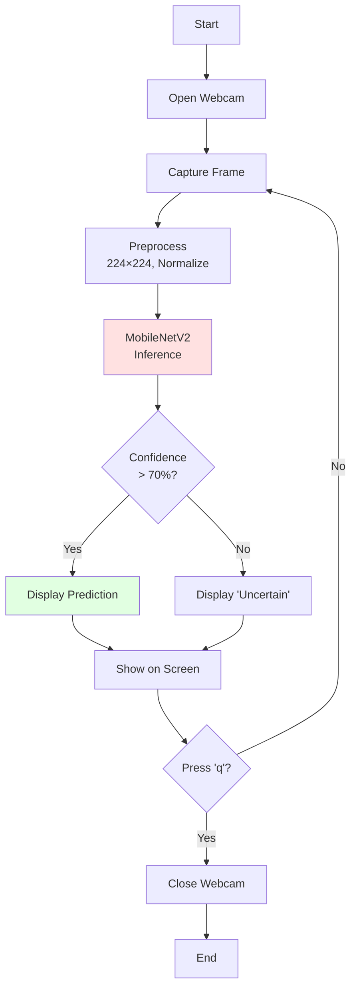

# AI-Based Smart Waste Detection System Using Webcam
## Detailed Project Plan

---

## 📌 Project Overview

**Title**: AI-Based Smart Waste Detection System Using Webcam  
**Type**: Educational AI/Computer Vision Project  
**Complexity**: Beginner-Friendly  
**Duration**: 1-2 days (with dataset ready), 3-4 days (including dataset collection)

### Goal
Create a lightweight, real-time waste classification system that runs on a laptop using a webcam to detect and classify waste into 6 categories: plastic, paper, metal, glass, organic, and non-recyclable.

### Key Constraints
- ✅ No Raspberry Pi or hardware modules
- ✅ Laptop + webcam only
- ✅ CPU-compatible (no GPU required)
- ✅ Simple and beginner-friendly
- ✅ Easy to setup and run

---

## 🎯 Learning Objectives

Students/users will learn:
1. **Transfer Learning**: Using pretrained MobileNetV2 model
2. **Data Preprocessing**: Image resizing, normalization, augmentation
3. **Model Training**: PyTorch training loops, loss functions, optimizers
4. **Model Evaluation**: Accuracy, precision, recall, confusion matrix
5. **Real-time Inference**: OpenCV webcam capture and live predictions
6. **Python Best Practices**: Clean code, documentation, project structure

---

## 📊 Technical Specifications

### Hardware Requirements
- **CPU**: Any modern processor (Intel i3+ or AMD equivalent)
- **RAM**: 4GB minimum, 8GB recommended
- **Storage**: 5GB free space (3GB dataset + 1GB dependencies + 1GB workspace)
- **Webcam**: Built-in or USB webcam

### Software Requirements
- **OS**: Windows 10/11, macOS, or Linux
- **Python**: 3.8, 3.9, 3.10, or 3.11
- **Package Manager**: pip

### Model Specifications
- **Architecture**: MobileNetV2 (pretrained on ImageNet)
- **Input Size**: 224×224×3 RGB images
- **Output**: 6 classes (softmax probabilities)
- **Model Size**: ~14 MB
- **Inference Speed**: 15-30 FPS on CPU, 60+ FPS on GPU

### Dataset
- **Source**: TrashNet (Kaggle/GitHub)
- **Total Images**: ~2,500 images
- **Categories**: 6 (plastic, paper, metal, glass, organic, non-recyclable)
- **Split**: 70% train (~1,750), 15% val (~375), 15% test (~375)
- **Augmentation**: Flip, rotate, brightness, crop

---

## 🗂️ Phase-by-Phase Plan

### Phase 1: Project Setup ✅
**Duration**: 30 minutes  
**Status**: In Progress

**Tasks**:
- [x] Create project folder structure
- [x] Write README.md
- [x] Create requirements.txt
- [x] Create .gitignore
- [x] Write dataset download script (template)
- [ ] Create workflow diagram

**Deliverables**:
- Complete folder structure
- Documentation templates
- Installation instructions

---

### Phase 2: Dataset Preparation
**Duration**: 1-2 hours (download) + 30 minutes (processing)

**Tasks**:
1. **Download Dataset** (`dataset/download_data.py`)
   - Provide Kaggle/GitHub download instructions
   - Create folder structure
   - Validate dataset integrity

2. **Organize Data** (`dataset/organize_data.py`)
   - Map TrashNet categories to 6 categories
   - Count images per category
   - Check for corrupted files

3. **Data Augmentation** (`dataset/augment.py`)
   - Implement albumentation transforms
   - Horizontal flip (p=0.5)
   - Rotation ±15° (p=0.5)
   - ColorJitter (brightness, contrast, saturation)
   - Normalize with ImageNet stats

4. **Train/Val/Test Split** (`dataset/split_data.py`)
   - 70/15/15 split with stratification
   - Fixed random seed (42) for reproducibility
   - Save split metadata (CSV)

**Quality Checks**:
- Minimum 200 images per category
- Balanced distribution (±10%)
- No duplicate images
- All images loadable

**Deliverables**:
- `dataset/processed/train/`, `val/`, `test/` folders
- `dataset_stats.txt` with image counts
- Sample augmented images

---

### Phase 3: Model Development
**Duration**: 2-3 hours

#### 3.1 Model Architecture (`model/model_architecture.py`)

```python
class WasteClassifier(nn.Module):
    """MobileNetV2-based waste classifier."""
    
    def __init__(self, num_classes=6, pretrained=True):
        super().__init__()
        # Load pretrained MobileNetV2
        self.backbone = models.mobilenet_v2(pretrained=pretrained)
        
        # Replace classifier head
        in_features = self.backbone.classifier[1].in_features
        self.backbone.classifier = nn.Sequential(
            nn.Dropout(0.2),
            nn.Linear(in_features, num_classes)
        )
    
    def forward(self, x):
        return self.backbone(x)
```

**Features**:
- Transfer learning from ImageNet
- Lightweight (14MB model)
- Fast inference (CPU-friendly)
- Dropout for regularization

#### 3.2 Training Configuration (`model/config.py`)

```python
CONFIG = {
    # Model
    'num_classes': 6,
    'pretrained': True,
    
    # Training
    'batch_size': 32,
    'num_epochs': 20,
    'learning_rate': 0.001,
    'weight_decay': 0.0001,
    
    # Data
    'image_size': 224,
    'num_workers': 2,
    
    # Optimizer
    'optimizer': 'adam',
    'momentum': 0.9,  # For SGD
    
    # Scheduler
    'scheduler': 'step',
    'step_size': 7,
    'gamma': 0.1,
    
    # Checkpointing
    'save_every': 5,
    'save_best_only': True,
}
```

#### 3.3 Training Script (`model/train.py`)

**Key Functions**:
1. `load_data()` - Create DataLoaders
2. `train_epoch()` - Single training epoch
3. `validate()` - Validation loop
4. `save_checkpoint()` - Save model weights
5. `plot_history()` - Visualize training curves

**Training Loop**:
```python
for epoch in range(num_epochs):
    # Train
    train_loss, train_acc = train_epoch(model, train_loader, optimizer, criterion)
    
    # Validate
    val_loss, val_acc = validate(model, val_loader, criterion)
    
    # Save best model
    if val_acc > best_acc:
        save_checkpoint(model, 'best_model.pth')
        best_acc = val_acc
    
    # Print progress
    print(f"Epoch {epoch+1}/{num_epochs}")
    print(f"  Train Loss: {train_loss:.4f} | Train Acc: {train_acc:.2f}%")
    print(f"  Val Loss: {val_loss:.4f} | Val Acc: {val_acc:.2f}%")
```

**Expected Training Time**:
- CPU: 15-30 minutes (20 epochs)
- GPU: 3-5 minutes (20 epochs)

**Target Metrics**:
- Train Accuracy: >90%
- Validation Accuracy: >80%
- Test Accuracy: >75%

#### 3.4 Evaluation Script (`model/evaluate.py`)

**Metrics to Calculate**:
1. Overall accuracy
2. Per-class precision, recall, F1
3. Confusion matrix (heatmap)
4. Classification report (table)
5. ROC curves (optional)

**Outputs**:
- `model/results/confusion_matrix.png`
- `model/results/classification_report.txt`
- `model/results/training_history.json`

**Deliverables**:
- Trained model (`model/checkpoints/best_model.pth`)
- Training curves (loss and accuracy)
- Confusion matrix visualization
- Per-class metrics table

---

### Phase 4: Webcam Detection App
**Duration**: 2 hours

#### 4.1 Inference Module (`app/inference.py`)

**Key Functions**:
```python
def load_model(model_path, num_classes=6):
    """Load trained model from checkpoint."""
    model = WasteClassifier(num_classes=num_classes, pretrained=False)
    model.load_state_dict(torch.load(model_path, map_location='cpu'))
    model.eval()
    return model

def preprocess_frame(frame):
    """Preprocess webcam frame for inference."""
    # Resize to 224×224
    # Convert BGR to RGB
    # Normalize with ImageNet stats
    # Convert to tensor
    return tensor

def predict(model, frame):
    """Run inference and return prediction."""
    tensor = preprocess_frame(frame)
    with torch.no_grad():
        output = model(tensor.unsqueeze(0))
        probabilities = F.softmax(output, dim=1)
        confidence, pred_class = torch.max(probabilities, 1)
    return pred_class.item(), confidence.item()
```

#### 4.2 Main Webcam App (`app/webcam_detect.py`)

**Features**:
1. **Live Webcam Feed**: Capture frames at 30 FPS
2. **Real-time Inference**: Predict every frame (or every N frames for performance)
3. **Visual Overlay**:
   - Predicted class name (large text, top-left)
   - Confidence score (top-right)
   - Color-coded border based on category
   - FPS counter (bottom)
4. **Keyboard Controls**:
   - `q`: Quit
   - `s`: Save screenshot
   - `SPACE`: Pause/Resume
   - `c`: Toggle confidence display
5. **Logging**: Optional CSV log of predictions

**Pseudo-code**:
```python
# Initialize
model = load_model('model/checkpoints/best_model.pth')
cap = cv2.VideoCapture(0)  # Open webcam

while True:
    # Capture frame
    ret, frame = cap.read()
    
    # Run inference
    pred_class, confidence = predict(model, frame)
    class_name = CLASS_NAMES[pred_class]
    
    # Draw overlay
    cv2.putText(frame, class_name, (10, 50), ...)
    cv2.putText(frame, f"{confidence*100:.1f}%", ...)
    
    # Display
    cv2.imshow('Waste Detection', frame)
    
    # Handle keyboard
    key = cv2.waitKey(1)
    if key == ord('q'):
        break
```

**Performance Optimization**:
- Run inference every 3rd frame (10 FPS inference, 30 FPS display)
- Use smaller model or quantization if needed
- Reduce webcam resolution if laggy

**Deliverables**:
- Fully functional webcam detection app
- Real-time predictions with <100ms latency
- Clean, user-friendly interface

---

### Phase 5: Documentation & Deliverables
**Duration**: 2 hours

#### 5.1 Workflow Diagram
Create visual diagram showing system flow:


Save as:
- `docs/diagrams/workflow_diagram.md` (Mermaid source)
- `docs/diagrams/workflow_diagram.png` (PNG export)

#### 5.2 Project Report (`docs/project_report.md`)

**Structure** (1-2 pages):
1. **Introduction**
   - Problem statement
   - Motivation
   - Objectives

2. **Methodology**
   - Dataset description
   - Model architecture (MobileNetV2)
   - Training process
   - Evaluation metrics

3. **Results**
   - Training/validation curves
   - Test accuracy: X%
   - Confusion matrix
   - Per-class performance

4. **Implementation**
   - Webcam detection app
   - Real-time inference
   - User interface

5. **Limitations & Future Work**
   - Small dataset size
   - Limited categories
   - Lighting sensitivity
   - Future: More categories, better accuracy, mobile app

6. **Conclusion**
   - Summary of achievements
   - Applications

#### 5.3 Presentation (`docs/presentation.pptx`)

**Slide Breakdown** (6 slides):

1. **Title Slide**
   - Project title
   - Your name
   - Date
   - Logo/icon

2. **Problem Statement**
   - Waste management challenges
   - Importance of recycling
   - Need for automated sorting
   - Project goal

3. **Solution Approach**
   - AI + Computer Vision
   - Webcam-based detection
   - Transfer learning
   - System architecture diagram

4. **Model & Training**
   - MobileNetV2 architecture
   - TrashNet dataset (6 categories)
   - Training process
   - Training curves graph

5. **Results & Performance**
   - Test accuracy: X%
   - Confusion matrix
   - Per-class metrics table
   - Sample predictions (images)

6. **Live Demo & Conclusion**
   - Screenshot of webcam app
   - Real-time detection demo
   - Future improvements
   - Thank you / Q&A

**Design Tips**:
- Use clean, modern template
- Include visuals (diagrams, charts, photos)
- Keep text minimal (bullet points)
- Use consistent color scheme (green/blue for environment theme)

#### 5.4 Screenshots
Capture and save:
- `docs/screenshots/webcam_demo.png` - App in action
- `docs/screenshots/confusion_matrix.png` - Evaluation results
- `docs/screenshots/training_curves.png` - Loss/accuracy plots

**Deliverables**:
- Workflow diagram (Mermaid + PNG)
- 1-2 page project report (Markdown)
- 6-slide PowerPoint presentation
- Screenshot gallery

---

## 📋 Complete File Checklist

### Root Files
- [ ] README.md
- [ ] requirements.txt
- [ ] .gitignore
- [ ] PROJECT_PLAN.md (this file)
- [ ] PROJECT_STRUCTURE.md
- [ ] LICENSE (MIT)

### Dataset (`dataset/`)
- [ ] download_data.py
- [ ] organize_data.py
- [ ] augment.py
- [ ] split_data.py
- [ ] raw/ (gitignored, user downloads)
- [ ] processed/train/, val/, test/

### Model (`model/`)
- [ ] train.py
- [ ] evaluate.py
- [ ] model_architecture.py
- [ ] config.py
- [ ] utils.py
- [ ] checkpoints/ (gitignored)
- [ ] results/

### App (`app/`)
- [ ] webcam_detect.py
- [ ] inference.py
- [ ] utils.py

### Docs (`docs/`)
- [ ] project_report.md
- [ ] presentation.pptx
- [ ] diagrams/workflow_diagram.png
- [ ] screenshots/

### Examples (`examples/`)
- [ ] plastic_bottle.jpg
- [ ] paper_bag.jpg
- [ ] metal_can.jpg
- [ ] glass_jar.jpg

---

## ✅ Acceptance Criteria

### Functional Requirements
1. ✅ `python model/train.py` trains model successfully
2. ✅ Model achieves >70% test accuracy
3. ✅ `python app/webcam_detect.py` opens webcam
4. ✅ Real-time predictions display on screen
5. ✅ Predictions update at >10 FPS
6. ✅ All keyboard controls work (q, s, SPACE, c)

### Documentation Requirements
1. ✅ README has clear setup instructions
2. ✅ All code has docstrings and comments
3. ✅ requirements.txt installs without errors
4. ✅ Workflow diagram is clear and accurate
5. ✅ Project report is well-written
6. ✅ Presentation is professional and complete

### Code Quality
1. ✅ Clean, readable code
2. ✅ Consistent naming conventions
3. ✅ Error handling (try-except blocks)
4. ✅ Input validation
5. ✅ Modular functions (no huge files)

---

## 🚀 Getting Started Checklist

For a new user to run this project:

### Setup (15 minutes)
- [ ] Clone/download repository
- [ ] Install Python 3.8+
- [ ] Create virtual environment
- [ ] Install dependencies: `pip install -r requirements.txt`
- [ ] Verify webcam: `python -c "import cv2; print(cv2.VideoCapture(0).isOpened())"`

### Daataset (1-2 hours)
- [ ] Run: `python dataset/download_data.py`
- [ ] Download TrashNet from Kaggle manually
- [ ] Extract to `dataset/raw/`
- [ ] Run: `python dataset/organize_data.py`
- [ ] Run: `python dataset/split_data.py`

### Training (30 minutes)
- [ ] Run: `python model/train.py`
- [ ] Wait for training to complete
- [ ] Check results in `model/results/`
- [ ] Verify `model/checkpoints/best_model.pth` exists

### Demo (Instant)
- [ ] Run: `python app/webcam_detect.py`
- [ ] Show waste items to webcam
- [ ] See predictions appear
- [ ] Press 'q' to quit

---

## 🎓 Educational Value

### Skills Demonstrated
1. **Machine Learning**: Transfer learning, model training, evaluation
2. **Computer Vision**: Image preprocessing, real-time capture
3. **Python**: OOP, modules, file I/O, error handling
4. **PyTorch**: Model definition, training loops, inference
5. **OpenCV**: Webcam capture, image display, drawing
6. **Project Management**: Structure, documentation, version control

### Suitable For
- Computer Science students (undergrad/grad)
- AI/ML bootcamp projects
- Hackathons
- Portfolio projects
- Science fair presentations

---

## 📞 Support & Next Steps

### If Issues Arise
1. Check troubleshooting section in README
2. Verify all dependencies installed
3. Test webcam separately
4. Try smaller batch size if out of memory
5. Check dataset is downloaded correctly

### Future Enhancements
- [ ] Add more categories (e-waste, textiles)
- [[] Improve model (EfficientNet, ResNet50)
- [ ] Web interface (Flask + React)
- [ ] Mobile app (React Native, Flutter)
- [ ] Deploy to cloud (Heroku, AWS)
- [ ] Add object detection (YOLO) for multiple items
- [ ] Multi-language support

---

**Plan Version**: 1.0  
**Last Updated**: 2025-12-04  
**Status**: Ready for Implementation  
**Estimated Completion**: 2-4 days
